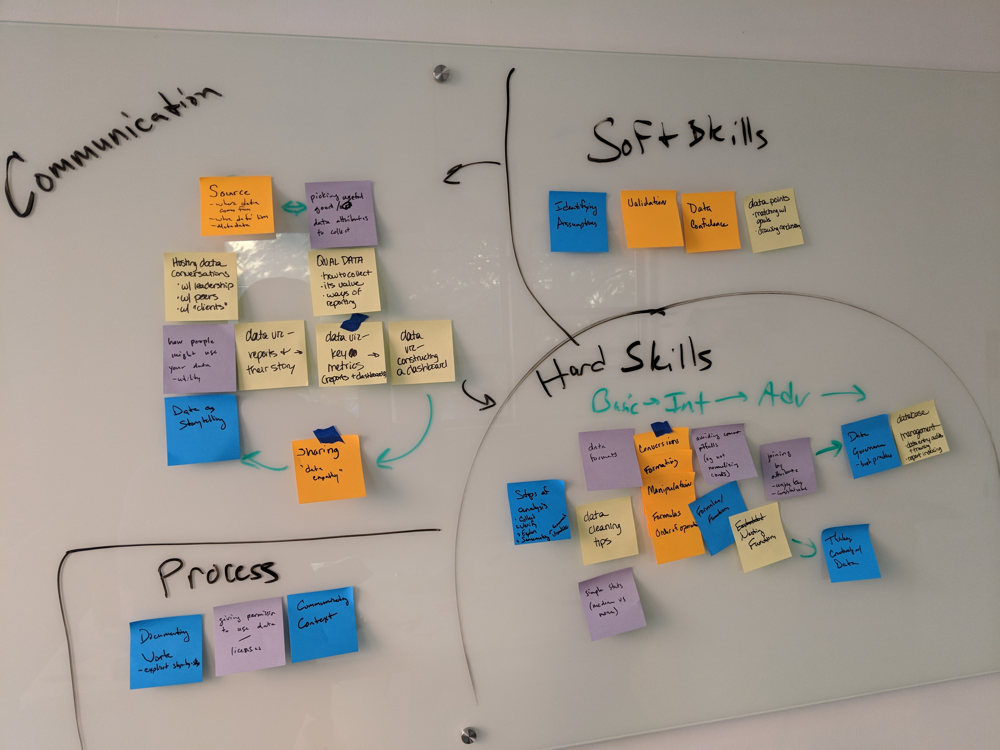
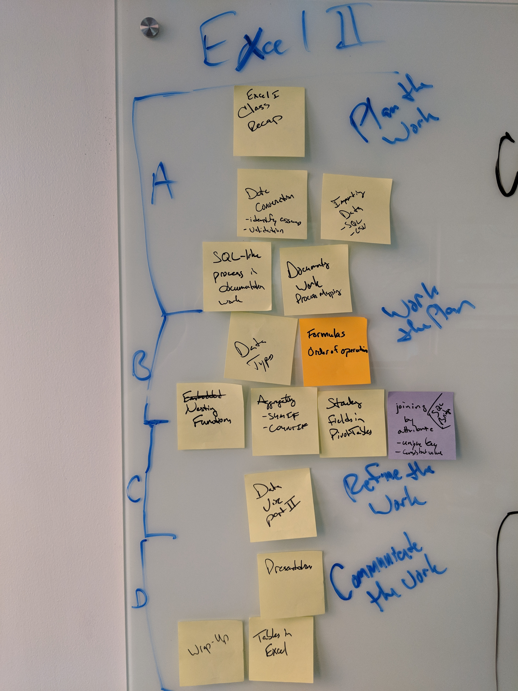

# Data Analysis with Excel II

## Summary
A one-day class reinforcing the skills necessary to clean, process, and visualize NYC Parks data, as well as introducing advanced functions and formulas, including joins, logic functions, and more advanced data visualization techniques with Microsoft Excel. This class reinforces problem ideation and process mapping skills taught in Introduction to Data Analysis and reinforces best practices for documenting work. Working collaboratively in small groups, participants develop an analytical question they explore throughout the class, presenting their data story at the end of class for constructive feedback.

## Target Audience
Employees of all levels of responsibility who have a good working knowledge of how to sort, filter, aggregate, and visualize data in Microsoft Excel, as well as a familiarity with the data analytics process. Participants should have some familiarity with basic functions and how to write formulas to transform data. Participants should complete Introduction to Data Analysis prior to attending this class for an introduction to problem ideation and process mapping.

## Goals
+ Reinforce and practice key steps in exploratory data analysis
+ Demonstrate advanced techniques with Microsoft Excel for data analysis
+ Reinforce brainstorming, problem ideation, and process mapping skills introduced in previous classes
+ Practice presenting true and compelling data stories to peers
+ Cultivate an attitude of curiosity to foster a culture of data-driven inquiry

## Participant Development Areas

**Conceptualizing:** Supported scoping of analytics problem and process

**Skill Development:** Advanced analytics operations, including formulas and functions to clean, process, and join NYC Parks data

**Integrating:** Investigate context using provided resources

**Communicating:** Project pitch with content critique in order to foster an entrepreneurial mindset with respect to developing and communicating analytical work

**Language Objective:** Develop greater fluency in basic data skills to conceptualize a problem with data, integrate context, and communicate a true and compelling data story to others

## Learning Objectives
+ Participants will be experienced in the key steps of exploratory data analysis with Microsoft Excel
+ Participants will be familiar with the techniques of advanced data analysis with Microsoft Excel
+ Participants will be practiced in using the techniques of brainstorming, problem ideation, and process mapping to scope and execute an analytical question
+ Participants will be practiced presenting analytical findings and describing the key steps in their analysis to their peers 
+ Participants will have an increased curiosity about how data can be leveraged for operational awareness and program success

## Outline
+ Welcome and Introductions
+ Excel I Recap
+ Plan the Work
    + Data Conversation (identifying assumptions/validation)
    + Documenting work (process mapping redux)
    + Importing Data (SQL, CSV)
+ Break
+ Work the Plan
    + Data Types
    + Formulas/Order of Operations
    + Nesting functions
    + Aggregating (SUMIF, COUNTIF)
    + Stacking Fields in PivotTables
    + Joining by Attributes (Unique Key VLOOKUP)
+ Lunch
+ Refine the Work
    + Data Visualization Redux
+ Communicate the Work
    + Presentations
+ Wrap-Up

## Exercise Descriptions

## Classroom Setup

